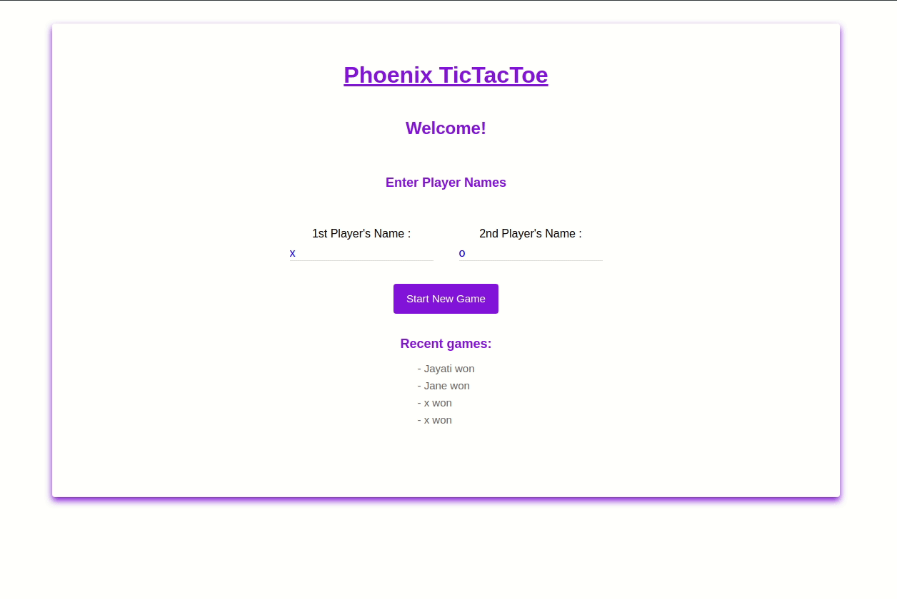

# Tic Tac Toe using django and react



## Set Up

### Frontend


1. Change to frontend directory and install the node packages
```
npm install
```

2. Start frontend server
```
npm run start
```

The default address is `http://localhost:3000`

Also if you run the frontend on different port the backend will not connect and you get CORS errors. To solve the error you need to whitelist the new frontend server address in `backend/backend/settings.py` line #126.


### Backend

The project will run (in icognito mode) without the backend server. The backend is required to store the win and loss details.

1. Create a Python3 virtual environment

```
virtualenv --python=$(which python3) env
```

2. Install all the python dependencies
```
pip install -r requirements.txt
```

3. change to backend directory and start the backend server using
```
python manage.py runserver
```

The default address is `localhost:8000` for the backend. The REST Api is at `localhost:8000/api`.

No need to set up the SQL database for the project. I have included `sqlite3` database file with project itself.

You can login to database by going to `localhost:8000/admin`. The username is `jayati` and the password is `123`.

If you wish to create a new database.

1. Delete the `db.sqlite3` file

2. Make migrations
```
python manage.py makemigrations scoreboard
```
```
python manage.py migrate
```

3. Create super user
```
python manage.py createsuperuser
```
